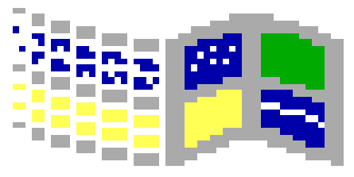
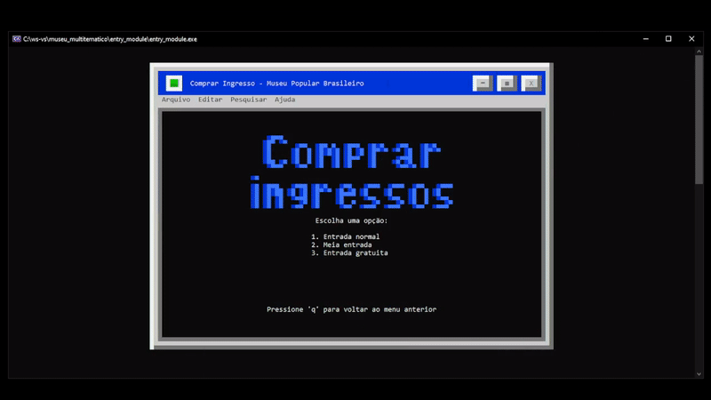
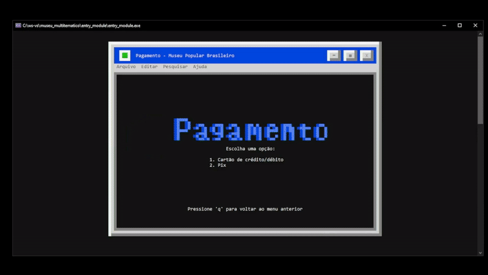
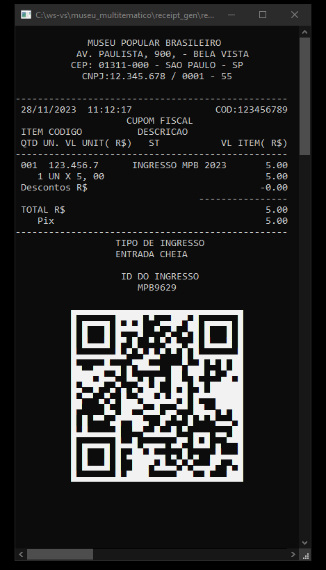
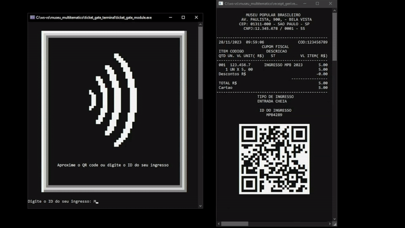
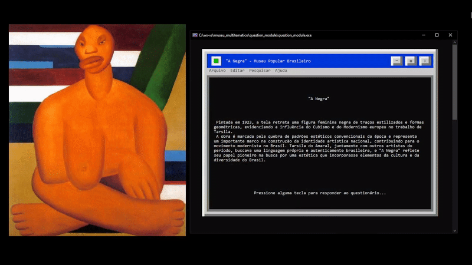
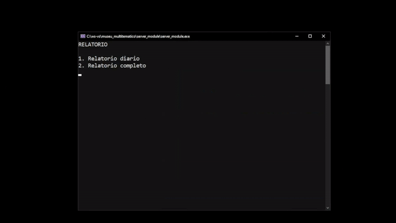

<h1>
     </a>
    Projeto de gerenciamento de museu multitemático
</h1>

Esse projeto foi criado para um trabalho do segundo semestre do curso superior de Análise e Desenvolvimento de Sistemas e tem como objetivo o gerenciamento de toda a parte de tecnologia de um museu com temas variados.

O projeto foi criado usando soquetes (winsock32) para gerenciamento de conexões entre cliente-servidor e threads (pthreads) para gerenciamento de clientes por parte do servidor. Cada um desses clientes representa um terminal, que estão separados da seguinte maneira:

* Terminais de entrada (entry_module): são responsáveis pela interação usuário-servidor para realização de cadastro de usuários, bem como compra de ingressos e pagamento,
* Terminais de catrada (ticket_gate_module): são responsáveis pela validação de ingressos e acesso aos temas do museu,
* Terminais de questionário (question_module): são responsáveis por exibir a descrição da arte correspondente, bem como possibilitar que o usuário responda a um questionário da arte.
* Terminais de arte (art_module): são responsáveis por exibir a arte correspondente ao seu terminal de questionário,
* Terminal de servidor (server_module): é responsável por gerenciar todos os outros terminais. Esse terminal utiliza de threads para gerenciar as funções de cada terminal que estiver conectado a ele. Nesse terminal é possível gerar relatórios com base nos dados adquiridos nos terminais de cliente.

## Funcionalidades

### Cadastro de usuários

Essa funcionalidade permite que o usuário se registre no sistema para assim ter acesso aos benefícios referentes a ele. É possível se registrar de 3 manerias diferentes, sendo elas: usuário comum, onde não há nenhum benefício; usuário especial, onde é possível adquirir um desconto de 50% sobre o valor do ingresso e, por fim, usuário com entrada gratuita.

Nessa etapa, o sistema verifica se as informações do usuário sao válidas. Caso não sejam, o usuario é informado do erro.

### Pagamento

Essa funcionalidade permite que o usuário realize o pagamento de acordo com suas preferências. Ao tentar efetuar o pagamento, o sistema verifica se as informações fornecidas são válidas e retorna com uma mensagem de erro caso não sejam.

### Geração de comprovante de compra

 </a>

Ao concluir o pagamento, o sistema gera um comprovante de compra com todas as informações referentes ao pedido. Essas informações são coletadas durante o processo de cadastro e pagamento para, enfim, gerar uma comprovante com um ID que será usado no terminal de catraca.

### Validação de ingresso

Juntamente ao comprovante gerado anteriormente, o usuário pode verificar se seu ingresso é válido ou não. Para fazer isso, o sistema recebe o ID que o usuário receber e verifica se le é válido ou se estão expirado. Caso esteja expirado, significa que o ingresso do usuário é válido, porém, não é possível usá-lo novamente para visitar algum tema do museu. Caso seja inválido, significa que o ingresso foi digitado incorretamente ou não existe na base de dados.

### Avaliação de arte

O usuário é capaz de visitar obras disponíveis no museu e avalia-las de acordo com suas preferências. Essa avaliação é usada posteriormente para definir quais obras serão mantidas no museu e quais não serao.

### Geração de relatórios

Disponível no terminal do servidor, essa funcionalidade é capaz de gerar relatórios com informações sobre o museu. É possível gerar relatórios diários ou completos, sendo a função de relatório completa um panorama geral sobre o museu desde a sua criação.

Para complementar, o sistema também cria um relatório de eventos do servidor, onde são exibidas informações de terminais-cliente que se conectaram com sucesso.

